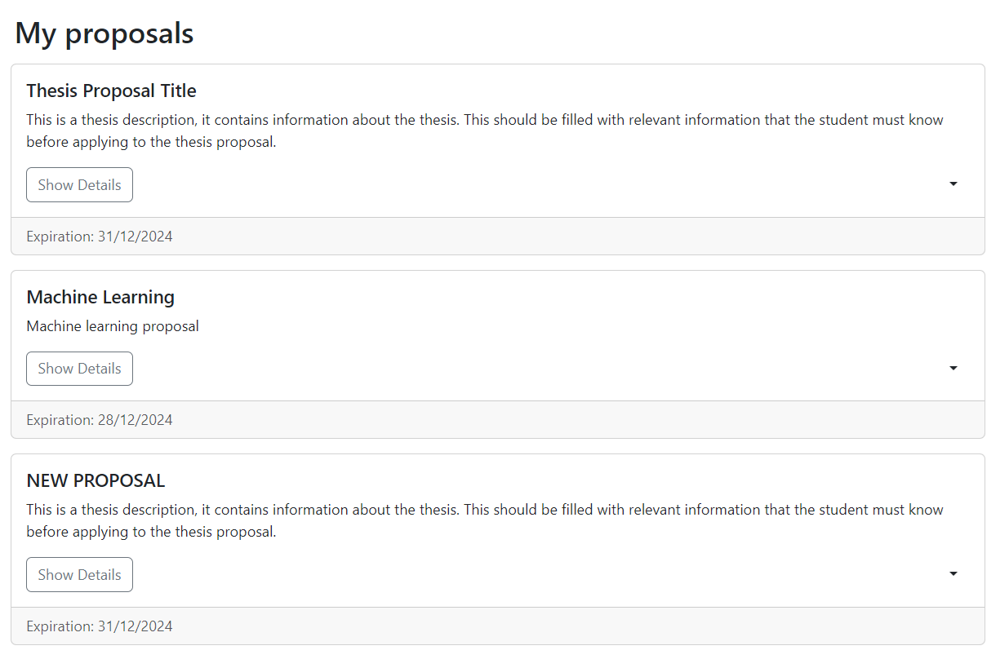
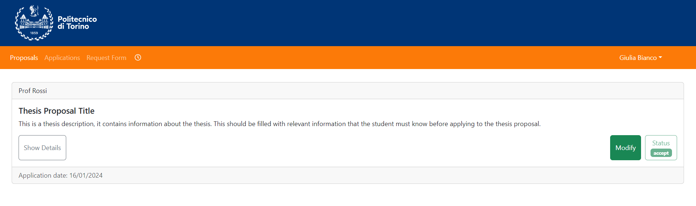
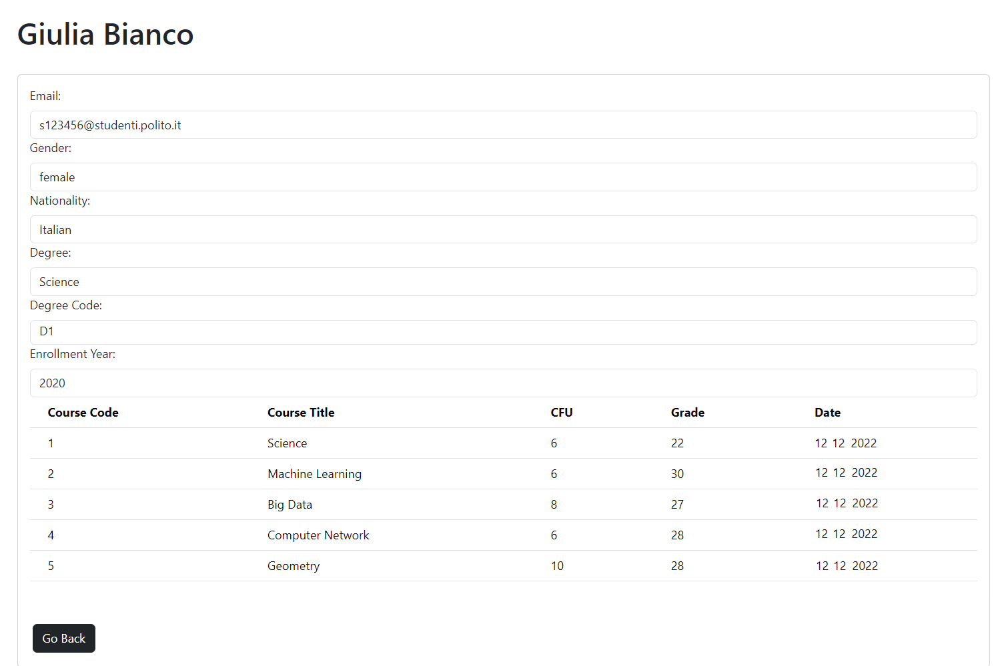

# Manual Tests for the Frontend GUI

## Story #1 - Insert Proposals
- Click on "Add Proposal" located at the top-right corner

- Fill out the following form

- After clicking "Add," it is added to the list of proposals

## Story #2 - Search Proposals

- If I input filters on the left, it searches for proposals based on my criteria (multiple filters can be used simultaneously)

## Story #3 - Apply for Proposal

- Click "Apply" to submit an application for a specific proposal

- If I have previously submitted an application, it shows an error

- Otherwise, fill out the form and submit the application

## Story #4 - Browse Applications

- Browse the list of all applications for a professor

## Story #5 - Accept Application

- Accept or reject an application

- After accepting or rejecting, the outcome is reflected in the list of applications

## Story #6 - Browse Applications Decisions

- Browse all my proposals, indicating outcomes as "accepted," "rejected," or "waiting"

## Story #7 - Browse Proposals

- Browse the list of all proposals for a professor

## Story #8 - Update Proposal

- Click on the right menu of a proposal and select "Update"

- Fill out the form to modify my proposal

- Once modified, it appears in the list as updated

## Story #9 - Notify Application Decision

- I log in as a professor

- I accept an application

- The email arrives correctly

## Story #10 - Delete Proposal

- Click on the right menu of a proposal and select "Delete"

- Confirm the deletion of the proposal

- The list of proposals will be updated after deleting the proposal

## Story #11 - Copy Proposal

- Click on the right menu of a proposal and select "Copy"

- The old proposal will be copied, and you can either modify the form or leave it unchanged

- The new proposal will appear in the list

## Story #12 - Archive Proposal

- Click on the right menu of a proposal and select "Archive"

- ubsequently, click on the blue "Archive" icon to display the list of archived proposals

## Story #13 - Access applicant CV

- Go to the "Applications" section and click on the student's name to view their CV

- It displays all the information about the student

## Story #14 - Notifty Application

- I log in from the student account

- I apply for a thesis

- The email arrives correctly

## Story #26 - Insert Student Request

- Go to the "Request Form" section and fill out the form for the thesis request

- The request is successfully submitted and awaits confirmation or rejection

## Story #15 - Proposal expiration

- The "Machine Learning Update" proposal is about to expire

-  Click on the virtual clock to change the date to one that exceeds the deadline of the proposal

-The proposal is archived successfully as the expiration date has been surpassed

## Story #27 - Secretary Approve Student requests

- Login to the secretariat's account

- Click on "Refuse" to reject the thesis request

- The result appears correctly

## Story #16 - Search Archive

- Go to the "Archive" section

- Filter by name, displaying only the archived proposals that match the filter

## Story #28 - Professor Approve Student requests

- Go to the "Thesis Requests" section

- Accept the student's thesis request

- It shows the correct operation I have requested

## Story #29 - Notify Professor Thesis Request

## Story #17 - Add Academic Co-Supervisor

- Click on "Add Proposal" located at the top-right corner

- Fill the form and add the co-supervisor mail

- Check on the co-supervisor account if there is present the new application

## Story #18 - Notify Expiration

- The "Machine Learning Update" proposal is about to expire

- A notification email is sent correctly

## Story #30 - Student Request from Application

- Click on "Modify" in a previously accepted application

- Fill out the form with the changes and click "Modify"

- A new thesis request appears with the modifications made to the previous one

## Story #19 - Browse Co-Supervised Proposals

- Browse the list of all proposals for a co-supervisor

## Story #20 - Notify Application Decision Supervisor

